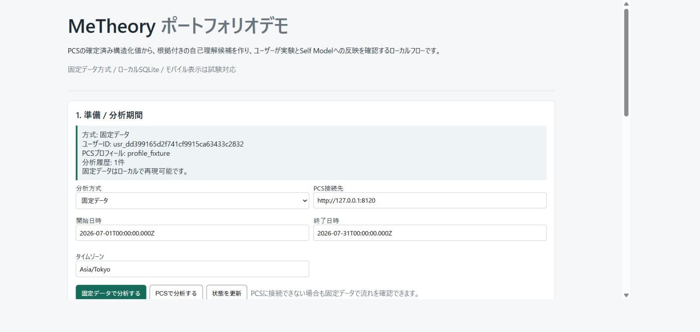
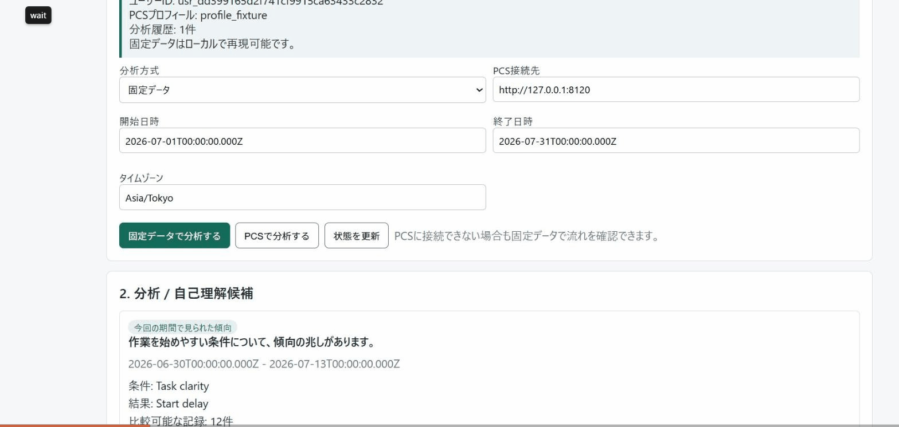

# MeTheory


## Portfolio Summary

MeTheory is a local-first engine for testing non-clinical self-understanding hypotheses from reviewed Personal Context Studio snapshots, preserving supporting and contradicting evidence for user review.

The current implementation includes hypothesis lifecycle management, experiment and observation data, deterministic evaluation, migration integrity checks, privacy and aggregate-only AI boundaries, the PCS cross-repository contract, and automated verification. It does not diagnose medical or psychological conditions, decide facts or evidence strength automatically, or receive Markdown bodies from PCS.
MeTheory is a local-first self-understanding and experiment engine. It receives
user-confirmed structured context from Personal Context Studio and uses its
deterministic hypothesis system when a user wants to test a self-belief.

The current product specification is [`docs/current-product-spec.md`](docs/current-product-spec.md).
For the practical self-understanding flow and its non-clinical analysis boundary,
see [`docs/self-understanding-practical-v1.md`](docs/self-understanding-practical-v1.md).
It is the source of truth for the Node.js, SQLite, and Personal Context Studio
integration. The mobile client is excluded from the current product scope.
Markdown authoring is editor-agnostic:
VS Code, Cursor, Obsidian, or another editor may open the same PCS notes folder.
MeTheory does not maintain an editor plugin or a second synchronized note copy.
Current normative specifications live under docs/spec/; historical decisions live under docs/archive/; future architecture research remains explicitly labeled. The official PCS contract version is defined by personal-context-studio/integration-contracts.

The MeTheory -> PCS template request flow is documented in [`docs/metheory-pcs-template-flow.md`](docs/metheory-pcs-template-flow.md). MeTheory resolves measurement requirements deterministically and PCS remains responsible for field matching, review, and activation.

The versioned PCS Connector Manifest used by the integration doctor is [`docs/metheory-pcs-connector.manifest.json`](docs/metheory-pcs-connector.manifest.json). It declares the actual local transport, profile-scoped authentication, `read_snapshot` and `submit_template_request` permissions, and explicitly does not claim `submit_import`.

The product boundary is explicit: the user chooses the scope of collection,
the system chooses when and what to collect, and AI may only propose bounded
interpretations or candidates. AI never decides facts, evidence strength,
notification timing, hypothesis status, or Self Model updates.



### Hypothesis review flow



The flow shows deterministic analysis, a hypothesis candidate, and the
explicit human approval step before any Self Model change.

## Contents

- `docs/archive/design-spec.md`: core loop and safety position.
- `docs/spec/domain-language.md`: canonical entities and hypothesis lifecycle.
- `docs/spec/hypothesis-evaluation.md`: versioned comparison evaluation and audit model.
- `docs/evidence-thresholds.md`: shared numerical floors for evidence and analysis readiness.
- `docs/spec/collection-responsibility.md`: collection ownership and three-layer presentation model.
- `docs/architecture-research.md`: target architecture and migration plan.
- `docs/integration-architecture.md`: Personal Context Studio, experiments, and analysis boundaries.
- `docs/technical-architecture.md`: module boundaries and runtime flow.
- `docs/privacy-retention.md`: retention, consent, erasure, and AI safety baseline.
- `docs/archive/implementation-roadmap.md`: phased implementation and beta criteria.
- `docs/current-product-spec.md`: current product scope, boundaries, and implementation status.
- `docs/self-understanding-practical-v1.md`: confirmed-value analysis and Self Model review flow.
- `docs/self-understanding-construct-catalog.md`: allowlisted non-clinical constructs and semantic-role mapping.
- `docs/external-assets.md`: local structured output, ActivityWatch, baseline self-perception, question quality, fixed charts, and provenance.
- `docs/personal-context-studio-integration.md`: the current Personal Context Studio record, search, Review, and MeTheory analysis boundary.

### PCS Integration Client setup

PCS analysis requires a separate profile-scoped Integration Client. In the PCS
dashboard, create a client with **`read_snapshot`** permission only and add the
target Profile ID to its allowed profiles. Copy the Client ID and Token shown
after creation and set them as `PCS_CLIENT_ID` and `PCS_CLIENT_TOKEN` alongside
`PCS_API_URL`, `PCS_PROFILE_ID`, and `PCS_TIMEZONE`.

The Token is shown only when the client is created and cannot be retrieved from
the client list. Use the matching Client ID and Token from the same creation
event, keep the Token local, and restart the MeTheory API after changing these
environment variables. Do not commit credentials. See
[`docs/personal-context-studio-integration.md`](docs/personal-context-studio-integration.md)
for the complete setup.
- `docs/notification-policy.md`: notification constraints and user controls.
- `prompts/ai-templates.json`: versioned AI templates.
- `schemas/domain-schema.json`: domain data contract.
- `schemas/personal-context-candidate-v1.schema.json`: versioned, read-only export contract for the separate Personal Context Studio.
- [Personal Context Studio](https://github.com/jinghaodao-tech/Personal-Context-Studio): the standalone local-first record, search, local-AI Review, and long-form template application that supplies confirmed analysis snapshots to MeTheory.
- `db/ts_mvp_schema.sql`: TypeScript runtime SQLite schema with Observation and Evidence.
- `packages/domain/src/index.ts`: TypeScript pure rules for evidence, transitions, notification policy, and AI candidate validation.
- `packages/domain/src/hypothesis/`: typed HypothesisSpec, episode construction, conditions, and deterministic evaluators.
 - `packages/contracts/src/index.ts`: shared TypeScript request contracts.
 - `docs/openapi-ai.yaml`: read-only AI HTTP contract.
 - `docs/mcp-tools.md`: read-only MCP tool boundary.
- `apps/api/src/server.ts`: TypeScript Node MVP API.

## Commands

Validate the JSON specification:

```powershell
python tools\validate_spec.py
```

Migrate the JSON specification catalog to `data/metheory-spec.sqlite3`:

```powershell
python tools\migrate_json_to_sqlite.py
```

The migration copies the old `data/preference_mirror.sqlite3` catalog to the
new name once, when the new catalog does not exist. The runtime application DB
is separate and uses `data/metheory.sqlite3`.

Run the TypeScript domain tests:

```powershell
npm.cmd test

# External-asset boundary tests
npm.cmd run test:external-assets
```

Start the TypeScript MVP API:

```powershell
npm.cmd run dev:api
```

The API listens on `http://127.0.0.1:8100`.

## Free records

Free-form Markdown records belong to
[Personal Context Studio](https://github.com/jinghaodao-tech/Personal-Context-Studio).
The Markdown folder is the human-readable source of truth. PCS watches it,
maintains a local search index, and exposes reviewed structured values to
MeTheory through a versioned localhost snapshot. Opening that folder in
Obsidian is optional and requires no MeTheory-specific plugin.

MeTheory does not store or index Markdown Entries. New free-record authoring,
indexing, template, extraction, Review, and record-level privacy work belongs
in PCS. MeTheory stores only its own experiments, observations, hypotheses,
Evidence, and user-approved Self Model updates.

See `docs/integration-architecture.md` for the current architecture, API
surface, timestamp semantics, and the planned search boundary.

## Local record search

Full-text Markdown search is a PCS responsibility. MeTheory never receives
Markdown bodies through the analysis bridge; it receives only the reviewed,
shareable values needed for a selected analysis period.


## Excluded client scope

The Expo/mobile client and its device-local notification, EAV, and dynamic
question flows are excluded from the current MeTheory product. They are not
maintained, tested, or published as part of the supported product path. The
supported flow is the local Node API, SQLite analysis engine, PCS snapshot
boundary, CLI, and Demo Web.

## Benchmark and verification

The verification suite includes domain, API acceptance, migration,
synthetic, OpenAPI contract, and benchmark smoke tests.

Commands: npm.cmd run verify, npm.cmd run benchmark:small,
npm.cmd run benchmark:medium, npm.cmd run benchmark:large, and
npm.cmd run benchmark.

SQLite benchmark results are written to the ignored artifacts directory and
include insert/query timings and EXPLAIN QUERY PLAN output. The large profile
uses 500,000 parameter_values; adjust the profile argument for a larger local
dataset.
## Local AI and Review

Local-AI template generation, Markdown extraction, stale-result checks, and
per-value Review belong to Personal Context Studio. MeTheory consumes only
confirmed, shareable values from PCS and never converts a free record into an
experiment observation implicitly. MeTheory's AI boundary remains available
for bounded explanation of already computed hypotheses; it does not own the
authoring workflow or alter Markdown.

## Privacy and Safe Delete

PCS owns `normal`, `sensitive`, and `highly_sensitive` record policies,
field-level consent, external-AI destination approval, and safe deletion of
record-derived data. MeTheory keeps separate access controls for experiment
parameters and never receives record bodies or secrets.

## Self-understanding vertical slice

`POST /v1/self-understanding/analyze` requests a reviewed PCS snapshot for a
selected one-to-four-week period, requires eight records by default, and returns
at most five deterministic, non-diagnostic hypotheses. When data is
insufficient it returns a concrete shortage instead of a hypothesis. Each
result includes a status, period, supporting and contradicting record IDs,
missing-data flags, a fallback explanation, a small next action, and a
proposed Self Model statement.

Request a PCS analysis snapshot for the selected period and analyze its
confirmed fields in MeTheory. Rate a result as `fits`,
`does_not_fit`, or `on_hold`; a `fits` review creates an editable proposal.
Only a separate explicit acceptance adds it to Self Model. See
[`docs/self-understanding-practical-v1.md`](docs/self-understanding-practical-v1.md)
for the complete boundary and API workflow.

PCS templates may attach an allowlisted semantic role to each field.
Ambiguous, sensitive, and role-changing roles require confirmation before they
are included in a snapshot.
Analysis maps confirmed roles to a non-clinical construct and records history
to distinguish emerging, state-dependent, and relatively stable evidence.
Fields from different templates remain separate unless both explicitly permit a
compatible semantic merge. See
[`docs/self-understanding-construct-catalog.md`](docs/self-understanding-construct-catalog.md).

From the workspace CLI, use
`self-understanding analyze --from=2026-07-01T00:00:00.000Z --to=2026-07-28T00:00:00.000Z`.

For Japanese documentation, see [`README_ja.md`](README_ja.md).

## Analysis integrity rules

`analysisMergeAllowed=false` keeps a field analyzable under an isolated
`isolated:<template>:<version>:<field>` parameter identity. Mergeable fields
use a semantic identity only when role, usage, type, scale, range, unit,
choice semantics, and privacy level are compatible. Numeric cohorts use
`value < midpoint` and `value >= midpoint`; a single-choice outcome is never
interpreted as success without `positiveValueKeys`, `orderedValueKeys`, or
`numericMapping` metadata.

Experiment observations are restricted to the draft's two groups, reject
paused experiments, validate timestamps and payload size, and return `409`
for an idempotency-key content conflict. A Self Model `propose_update` review
updates an explicitly selected belief and writes an append-only revision;
`create_new` and `keep_separate` do not mutate an existing belief.

The real cross-repository check is `npm run test:pcs-live-e2e` with
`PCS_REPO_PATH` set to a checked-out Personal Context Studio repository. The
GitHub workflow checks out both repositories, installs each with `npm ci`,
then runs MeTheory verification and this live snapshot test.
