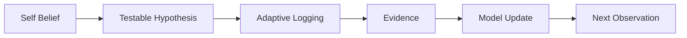

# Preference Mirror Design Spec

## Core Loop

Preference Mirror does not store self-beliefs as fixed profile facts. It converts them into testable hypotheses, collects lightweight observations, evaluates evidence, and updates the user's self-model only when evidence is sufficient.



## Design Principles

1. Minimize check-in fields per hypothesis to reduce EMA burden.
2. Keep observed facts separate from interpretation.
3. Make "we do not know yet" a first-class state.
4. Restrict AI to structured, bounded tasks.
5. Let users control notification windows, permission, and channel importance.

## Responsibility Split

| Area | AI may do | System must do | AI must not do |
|---|---|---|---|
| Input processing | Structure free text into allowed observation fields and mark uncertainty. | Preserve raw text, timestamps, confirmed vs inferred values. | Convert ambiguous text into confirmed facts. |
| Hypothesis generation | Suggest up to 3 candidate hypotheses from detected differences, mismatches, exceptions, or gaps. | Choose triggers and map candidates to templates. | Auto-adopt unlimited hypotheses or invent unsupported fields. |
| Next question | Propose one question for missing data. | Make the final question choice, control frequency, and manage the question library. | Decide notification timing or increase frequency. |
| Explanation | Rewrite evidence into readable, non-diagnostic language. | Compute counts, differences, evidence thresholds, and validator results. | Infer causality, personality, diagnosis, or final evidence strength. |
| Safety and privacy | None. | Consent, permissions, retention, deletion, encryption, audit logs, and disclaimers. | Act as a policy or medical authority. |

## Safety Positioning

Preference Mirror is a self-observation and reflection app. It is not intended for medical diagnosis, treatment, emergency response, or psychological assessment.

Recommended disclaimer:

```text
Preference Mirrorは、日常の自己観察と振り返りを支援するアプリです。
医学的・心理学的な診断、治療、緊急時対応を目的としたものではありません。
表示される内容は、あなたの記録に基づく仮説や傾向の提示であり、原因や病名を断定するものではありません。
不調が強い場合や安全に関わる懸念がある場合は、医療機関や適切な相談先に連絡してください。
```

