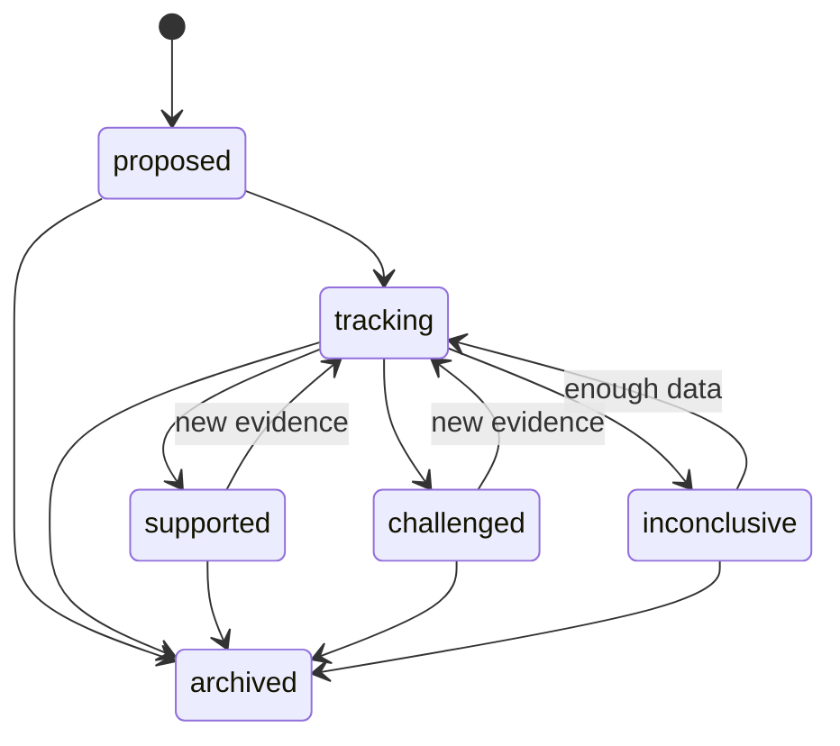

# Canonical Domain Language

The values in this document are the wire-level values used by the MVP. JSON,
SQLite, TypeScript, and AI contracts must use the same lower-snake-case values.

## Hypothesis lifecycle

`proven` and `diagnosed` are intentionally not valid states. A status is an
evaluation of available evidence under a named rule version, not a fact about
the person.

## Core vocabulary

| Concept | Type | Responsibility | Source of truth |
| --- | --- | --- | --- |
| User | Entity | Owns personal data and consent | user table |
| SelfBelief | Entity | User-authored self statement | self_beliefs |
| Hypothesis | Aggregate root | Testable claim and lifecycle | hypotheses |
| HypothesisTemplate | Value object | Allowed claim shape and required fields | versioned prompt/schema |
| CheckIn | Entity | One scheduled observation opportunity | checkin_events |
| QuestionDefinition | Value object | One allowed question and response shape | policy bundle |
| Response | Entity | Raw user answer, append-only | responses |
| Observation | Entity | Structured fact linked to a response | observations |
| EvidenceLink | Entity | Supports/challenges/insufficient relation | evidence_links |
| EvidenceSummary | Value object | Deterministic aggregate for one hypothesis | derived summary |
| HypothesisEvaluation | Entity | Historical evaluation under rule version | evaluation_history |
| SelfModel | Aggregate root | User-visible revision of evaluated hypotheses | self_models |
| Recommendation | Entity | Fit, explore, test, or challenge action | recommendations |
| NotificationPreference | Value object | Permission, quiet hours, and budget | preferences |
| AdaptiveLoggingPolicy | Domain service | Selects the next eligible question | policy module |
| AIRequest / AIResult | Entities | Audited assistive processing boundary | ai_requests / ai_results |

## Aggregate rules

- A Hypothesis references a SelfBelief by ID; it does not embed the belief.
- An EvidenceLink references a Hypothesis and an Observation by ID.
- A Response owns the raw payload and may have many Observations.
- AI-inferred Observations never overwrite user-confirmed Observations.
- Missing responses have a missing reason and cannot create a challenge link.
- Cross-aggregate references are IDs; domain services coordinate transactions.

## Observation provenance

| Layer | Meaning | Mutable |
| --- | --- | --- |
| Raw Response | Exact submitted answer and client metadata | No |
| User Observation | User-confirmed structured value | No; supersede with a new record |
| AI Observation | Candidate inferred from text | No; confirmation creates a user observation |
| System Observation | Deterministic value such as elapsed time | No |
| EvidenceLink | Relation to a hypothesis under a rule version | Recomputed, history retained |

The MVP uses append-only source events plus ordinary derived tables. Full event
sourcing is rejected because command replay, projections, and event versioning
would add more operational surface than this portfolio-scale product needs.
