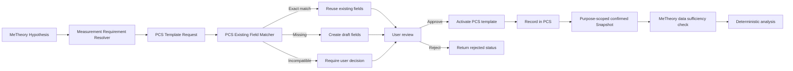

# MeTheory -> PCS テンプレート要求

MeTheoryは仮説から、許可されたsemantic role・値型・範囲・収集タイミングを決定的に解決します。`POST /v1/hypotheses/:id/pcs-template-request` は要求をMeTheory側へ冪等に保存し、`send: true` のときだけ既存の localhost PCS APIへ送信します。

PCSは要求を既存フィールドのsemantic role、値型、範囲、選択肢、用途、公開設定で照合します。既存項目だけで満たせる場合は新テンプレートを作らず、足りない項目だけをdraftへ入れます。照合結果は `exact_match`、`compatible_match`、`needs_user_confirmation`、`missing`、`incompatible` を区別します。

状態は `draft -> pending_user_review -> approved -> activated` を基本とし、`partially_matched`、`rejected`、`failed` も保持します。承認と有効化は別操作です。MeTheoryはPCSのDBへ直接アクセスせず、要求送信と状態取得APIだけを使います。要求ID、仮説ID、結果、失敗種別はMeTheoryのSQLiteへ保存し、秘密情報はログや要求本文へ入れません。

## API例

```json
POST /v1/hypotheses/hyp-1/pcs-template-request
{
  "userId": "user-1",
  "purpose": "作業開始条件を確かめる",
  "send": true,
  "requirements": [
    {"semanticRole":"task_clarity","analysisUsage":"condition","valueType":"scale","minimum":1,"maximum":5,"collectionTiming":"before_activity"},
    {"semanticRole":"start_delay","analysisUsage":"outcome","valueType":"duration_minutes","minimum":0,"maximum":120,"collectionTiming":"after_activity"}
  ]
}
```

テンプレートの編集・承認・有効化はPCSの責務です。MeTheoryがAIや既存フィールドを根拠なく統合したり、承認なしに有効化したりすることはありません。



## Group sufficiency

`data-sufficiency` uses an explicit PCS `groupKey` when present. Otherwise, condition values receive deterministic keys in the form `semanticRole:value`, so `minimumPerGroup` can detect imbalance without inventing data outside the snapshot.

## 記録開始後の充足度

`GET /v1/hypotheses/:id/data-sufficiency?userId=...` はPCSの確定済み分析スナップショットを期間内で集計します。未承認、期間外、範囲外の値は使用数へ含めず、`template_required`、`waiting_for_template_review`、`ready_to_record`、`collecting`、`insufficient_group_balance`、`ready_for_analysis`、`analysis_completed` を返します。分析前に不足項目と除外数を確認できます。
