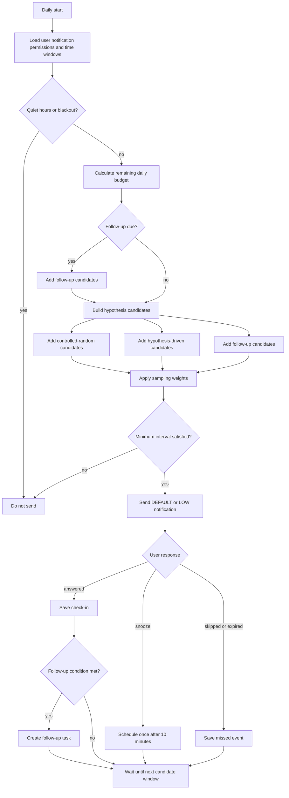

# Notification Policy

## Initial Parameters

- `controlled_random`: 50%
- `hypothesis_driven`: 30%
- `follow_up`: 20%
- `max_per_day`: 3
- `max_per_hour`: 5
- `minimum_interval_minutes`: 90
- `default_channel_importance`: `DEFAULT` or `LOW`

These are product defaults, not research constants. Tune them from opt-in usage metrics and user feedback.

## Flow

## User Controls

- `allowed_time_ranges`
- `quiet_ranges`
- `max_per_day`
- `notification_permission`
- `channel_importance_preference`

The user controls the collection scope and permission. The system chooses the
concrete minute, question, notification kind, cooldown, and budget outcome.
Exact daily notification times are never user-configured. Use `random`,
`hypothesis`, and `follow_up` in storage; product copy may label them
`RANDOM_CHECK_IN`, `HYPOTHESIS_CHECK_IN`, and `FOLLOW_UP_CHECK_IN`.

## UX Rules

- Ask one question per check-in.
- Target answer time under 10 seconds.
- Prefer multiple choice, yes/no, and small numeric fields.
- Use free text only as supplemental MVP input.
- Provide three response actions: answer now, snooze 10 minutes, skip this time.
- Avoid sensitive notification text on lock screens. Use wording such as `1件のチェックインがあります`.
