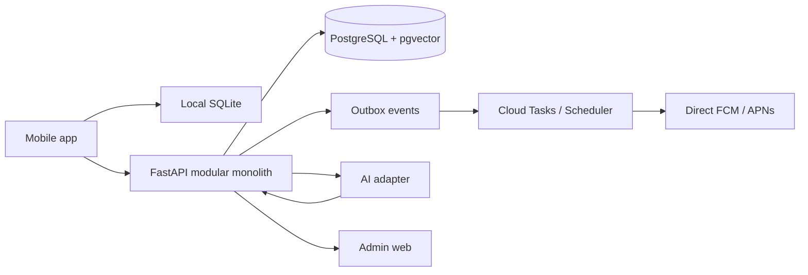

# MeTheory Technical Architecture

## Decision summary

The MVP is a mobile-first modular monolith. The deterministic product core owns
event storage, evidence aggregation, hypothesis status, notification policy,
validation, and final decisions. AI is an assistive boundary for structuring,
hypothesis candidates, and constrained wording only.

| Layer | MVP choice | Boundary |
| --- | --- | --- |
| Mobile | Expo / React Native, `expo-sqlite`, `expo-notifications` | Offline answers and a local question bundle |
| Admin web | Next.js App Router | Internal review and experiment configuration |
| API | FastAPI and Pydantic | Authenticated sync, response intake, and insights |
| Database | PostgreSQL 16 and pgvector | Source events, derived summaries, and embeddings |
| Jobs | GCP Cloud Tasks and Cloud Scheduler | Delayed delivery, retries, and policy runs |
| Push | Direct FCM / APNs | Minimal third-party data flow |
| AI | Hosted provider behind an adapter | Schema-constrained, versioned requests |
| Operations | OpenTelemetry, Sentry, and PostHog | Traces, errors, and product events |

## Runtime flow

## Domain rules

1. `checkin_events` and `responses` are append-only source records.
2. Evidence summaries and hypothesis statuses are derived and versioned.
3. Missing responses are recorded as missing data, never as negative evidence.
4. Random, hypothesis-driven, and follow-up flows have separate policy goals.
5. AI failure must not stop basic check-ins or deterministic analysis.
6. UI separates observation facts, structured interpretation, and hypothesis candidates.
7. Every AI result stores provider, model, schema version, input hash, and confidence.

## Module boundaries

| Module | Owns | Must not own |
| --- | --- | --- |
| Observation policy | Question selection, quiet hours, notification budget | AI interpretation |
| Notification service | Scheduling, delivery, receipts, invalid-token handling | Evidence status |
| NLP structuring | Constrained extraction and redaction-aware requests | Fact aggregation |
| Evidence aggregator | Counts, comparison cells, and deterministic summaries | Free-form narrative |
| Hypothesis engine | Candidate validation and status transitions | Medical or personality diagnosis |
| Privacy service | Consent, retention, export, and erasure workflows | Product ranking |

## First implementation slice

1. Add authenticated user and device registration.
2. Implement response intake with idempotency keys and offline sync.
3. Implement deterministic Random / Hypothesis / Follow-up policy functions.
4. Generate evidence summaries from raw responses and a pinned rule version.
5. Add AI adapter calls only after redaction and JSON-schema validation.
6. Add retention jobs, export, and erasure before external beta testing.
